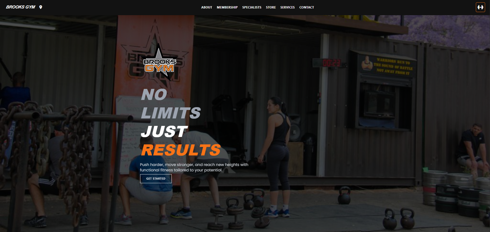
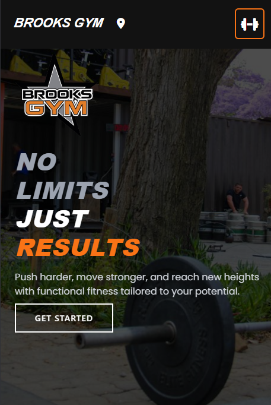
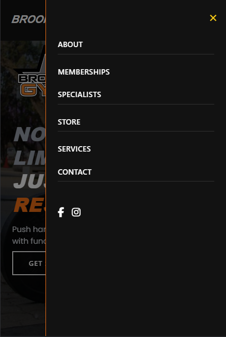
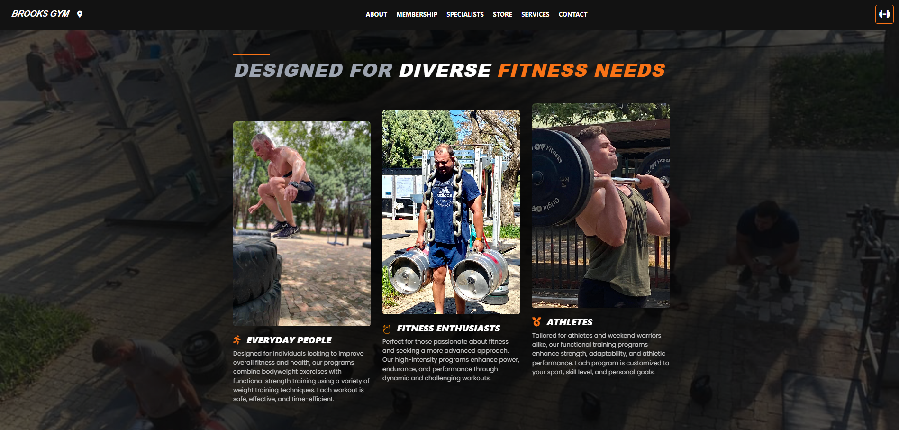
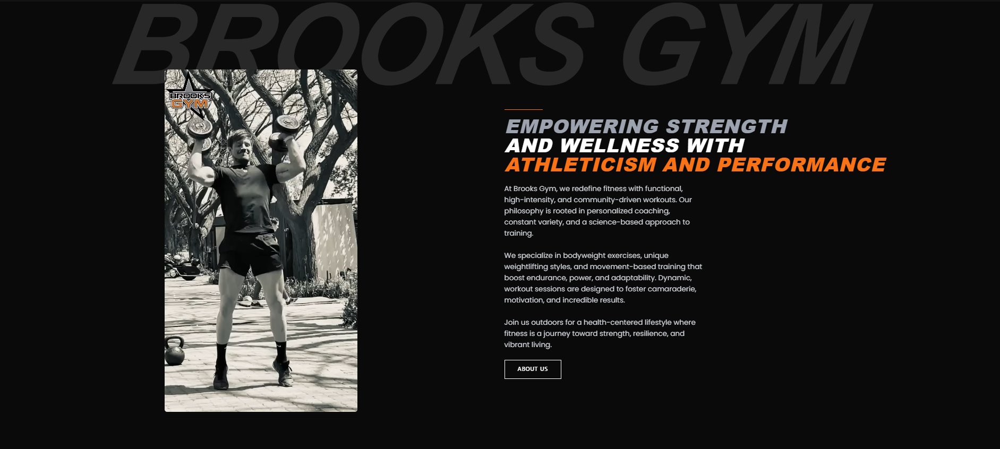
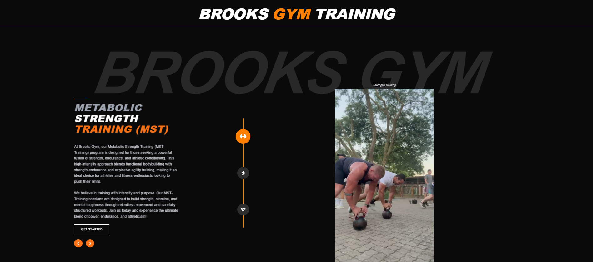
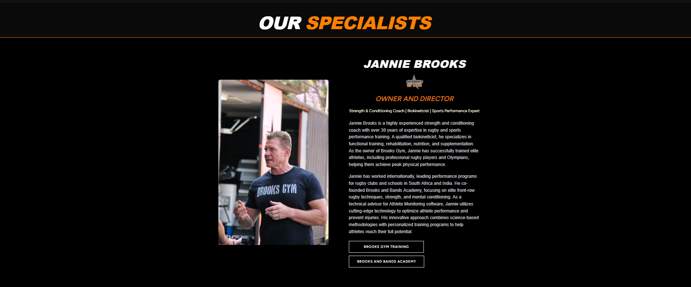
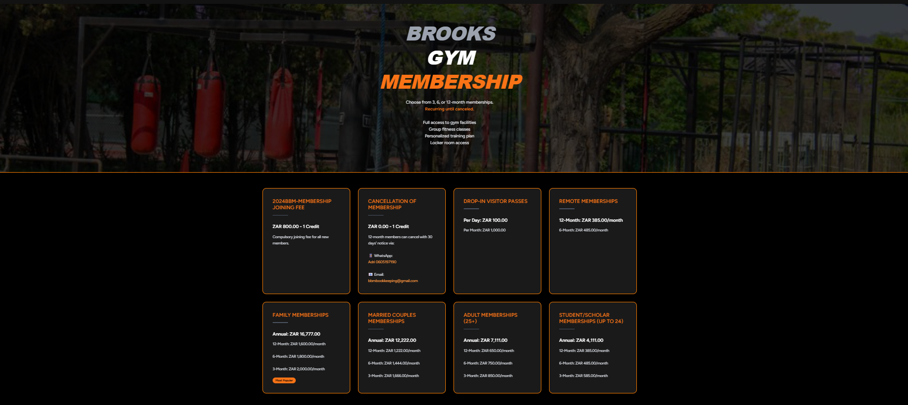
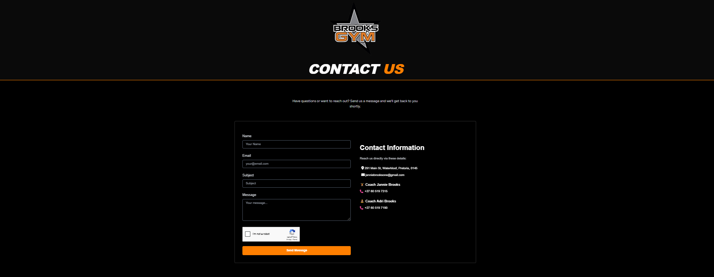
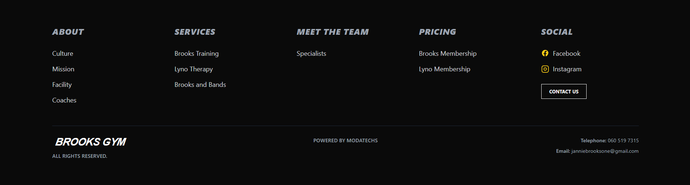

# 🏋️ Brooks Gym Website

Modern, high-performance, fully responsive website built for **Brooks Gym**. It uses Laravel 12, Tailwind CSS, Alpine.js, and a custom Docker stack. Designed for fitness businesses that want strong branding, animations, and SEO-ready structure.

---

## 🔗 Live Site

**Visit here** → [https://brooksgym.co.za](https://brooksgym.co.za)

---

## 🎓 Tech Stack & Features

### 💡 Frontend

* **Tailwind CSS** with custom animations and utilities
* **Alpine.js** for dropdowns, interactivity, and transitions
* **Custom JS modules** (e.g. staggered cards, scroll fade-ins, video reveal)
* Font Awesome for icons
* Preloaded backgrounds + lazy loading

### 🚀 Backend

* **Laravel 12**
* **Breeze** for starter auth structure
* **Spatie Sitemap** for SEO
* **Rank Math WordPress SEO sync** (via `SeoHelper.php`)
* Modular Blade layout with `@include` structure

### ⚖️ Dev Environment

* **Vite** for asset bundling
* **Docker** multi-container setup:

    * PHP + Laravel
    * Nginx
    * Node
    * MySQL (custom port 3307)

### 📊 Analytics + Meta

* Meta + OpenGraph populated via `SeoHelper` from WordPress Rank Math REST API
* Google reCAPTCHA integration
* Mobile-first + `darkMode` enabled

---

## ⚙️ How to Run Locally

### 🚿 1. Clone & Install

```bash
git clone https://github.com/Danilo-Giacinti/brooks-gym-website.git
cd brooks-gym-website
cp .env.example .env
composer install
npm install
php artisan key:generate
php artisan migrate
npm run dev
```

### 🛣️ 2. Docker (Optional)

```bash
docker-compose up --build -d
```

To stop:

```bash
docker-compose down
```

### 📉 Cypress Testing

```bash
npm run cypress:open
```

---

## 📂 File Structure Highlights

```
resources/
├── views/           # Blade views
├── js/
│   ├── animations/  # slideIn.js
│   ├── modules/     # fade-in-cards.js, video.js, scroll-animations.js
│   └── utils/       # logger.js, observer.js
├── css/
│   └── custom/      # app.css
public/assets/       # logos, background, videos
routes/web.php       # Routes
```

---

## 🚀 Example Animations

* `fade-in-cards.js`
* `slide-in-left.js`
* `hero-animate.js`
* `video-replay.js`
* `stagger-card-content.js`

These are triggered via class-based animations and scroll listeners.

---

## 🌍 SEO & Social Sharing

* Open Graph meta tags for all pages
* Meta title + description from WordPress Rank Math via REST
* Social icons + structured meta

---
## 📷 Screenshots

> Preview of key sections across desktop and mobile views.

| 📍 Section                | 🖼️ Screenshot |
|---------------------------|--------------|
| 🏠 Hero Section           |  |
| 📱 Mobile Navigation (v1) |  |
| 📱 Mobile Navigation (v2) |  |
| 🧱 Services Grid          |  |
| 🎥 Video Reveal Section   |  |
| 🏋️ Training Carousel     |  |
| 🧑‍🏫 Specialists Section |  |
| 💸 Membership Info        |  |
| 📞 Contact Page           |  |
| ⬇️ Footer section         |  |


---

## 👤 Author

**Danilo Giacinti**
Founder & Developer at Modatechs
Email: [danilogiacinti7412@gmail.com](mailto:danilogiacinti7412@gmail.com)

---
## 💡 Why I Built This

As a self-taught full-stack developer passionate about fitness and clean UI/UX, I built this website to help **Brooks Gym** showcase their services online. The goal was to create a blazing-fast, SEO-optimized, mobile-friendly experience with strong branding and modern animations.

This project helped me strengthen my skills in:
- Building responsive layouts with Tailwind
- Integrating Laravel with Docker and Vite
- Bridging Laravel and WordPress via REST for SEO
- Writing Cypress tests for UI stability

It's now live and in use at [brooksgym.co.za](https://brooksgym.co.za) — and serves as a real-world portfolio project for future client work and full-stack roles.

---


## 🌐 License

MIT

---

## ✉️ Future Plans

* Contact form submission + CRM integration
* Laravel + WordPress headless hybrid for SEO
* Blog section powered by WordPress API
